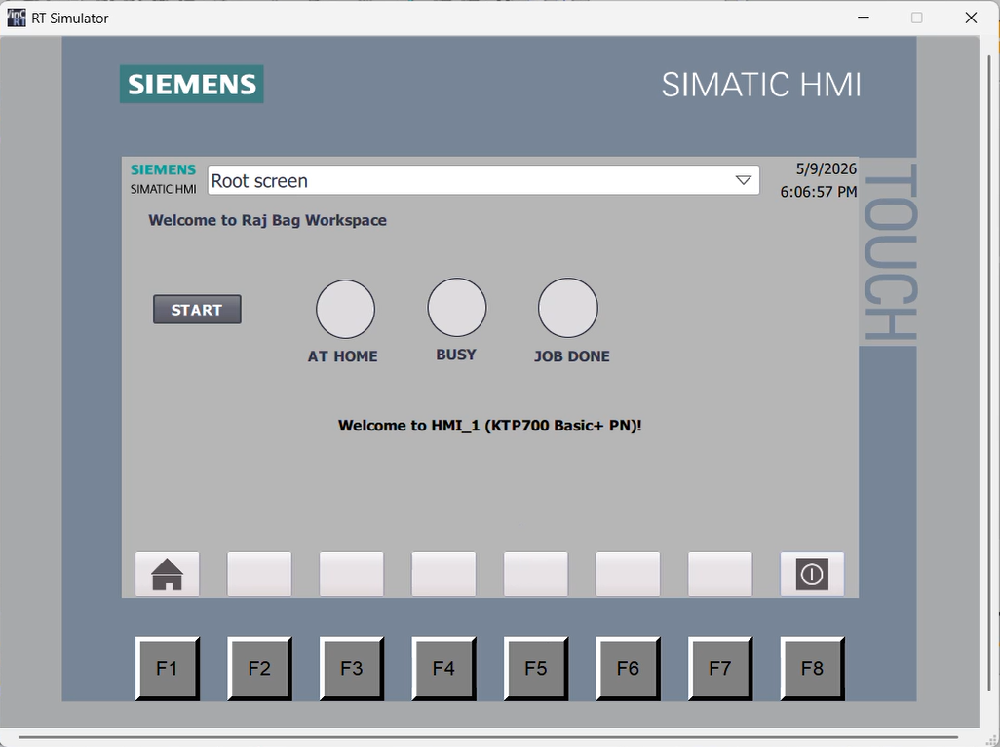
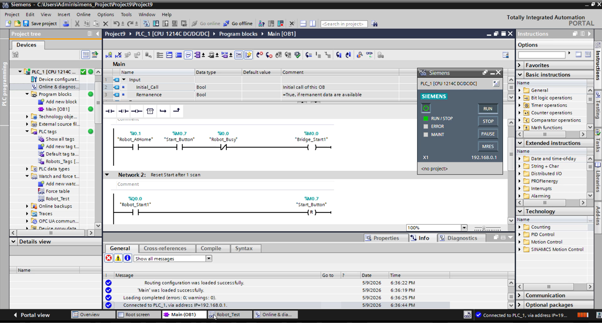
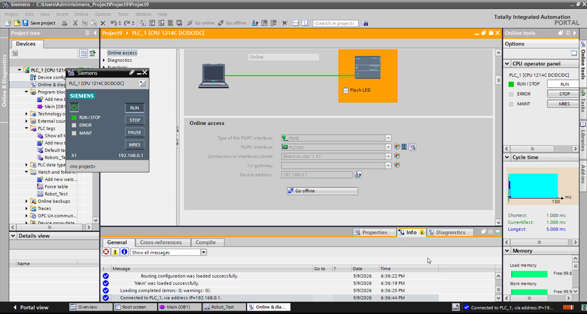

# ABB Robot & Siemens PLC Integration — Virtual Commissioning

## Project Overview
A fully simulated Industry 4.0 robot cell integrating an ABB IRB 1200
robot with a Siemens S7-1214C PLC via virtual PROFINET communication.
Zero physical hardware required.

## Demo Video

## System Architecture
TIA Portal (Ladder Logic + HMI)
↕ PLCSim
NetToPLCSIM (Port 102 / 127.0.0.1)
↕ TCP/IP
RSConnectDIOToSnap7 (SmartComponent)
↕
ABB Virtual Controller (RobotWare 6.16)
↕ RAPID
IRB 1200 Robot (4-position state machine)

## Technologies
| Tool | Version | Purpose |
|---|---|---|
| ABB RobotStudio | 2025.5 | Robot simulation |
| RobotWare | 6.16.03 | Virtual controller |
| RAPID | — | Robot programming |
| Siemens TIA Portal | V17 | PLC programming |
| S7-PLCSIM | V17 | Virtual PLC |
| WinCC Basic | V17 | HMI design |
| NetToPLCSIM | 1.2.5 | PROFINET bridge |
| RSConnectDIOToSnap7 | Latest | Signal mapping |

## Robot Program Logic
The RAPID program implements a state machine:
1. Robot moves to pHome → sets doAtHome = 1
2. Waits for diStart1 signal from PLC
3. Moves to pPickMachine1 → simulates work (1 sec)
4. Moves to pPlace → deposits part
5. Returns to pHome → sends doJobDone to PLC
6. Loops continuously

## PLC Logic
- Ladder logic interlock: robot only starts when AtHome=1 AND Busy=0
- WinCC KTP700 HMI with START button and 3 status lamps
- 10 tags across Q, I, and M memory areas
- Communication via M-memory bridge tags (M0.0–M0.4)

## I/O Signal Mapping
See [docs/IO_Signal_Mapping.md](docs/IO_Signal_Mapping.md)

## Screenshots
### HMI Screen

### Ladder Logic

### PLCSim Running

## Key Learning Outcomes
- Virtual commissioning workflow used in automotive manufacturing
- PROFINET communication protocol simulation
- PLC-Robot handshaking via digital I/O interlocks
- Industry 4.0 integration without physical hardware

## Author
**Raj Manoj Bag**
M.Sc. Robotics Candidate — Germany 2026
[LinkedIn](https://www.linkedin.com/in/rajbag/)

## License
MIT License
